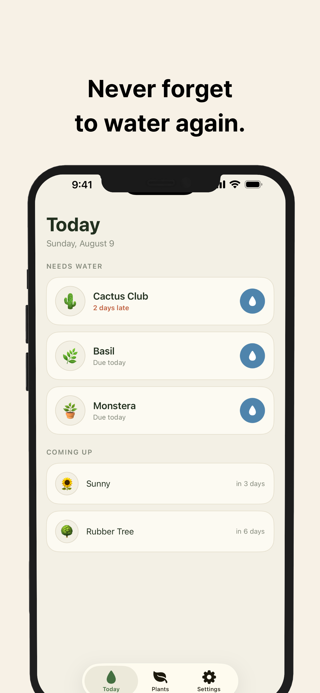
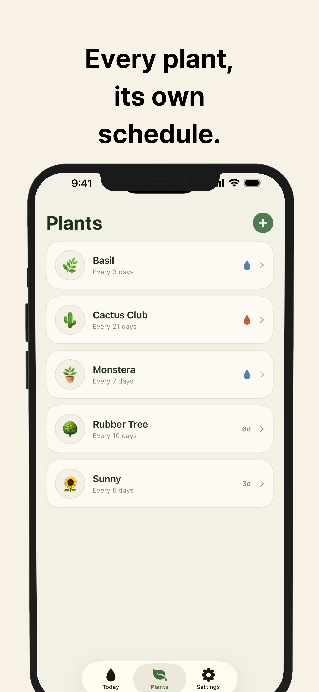
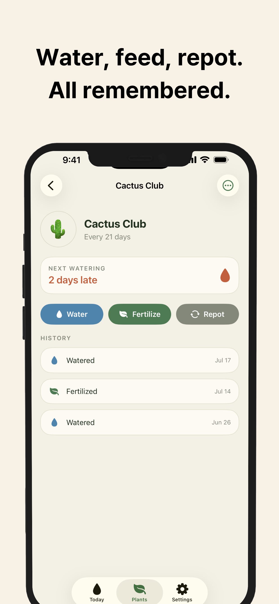
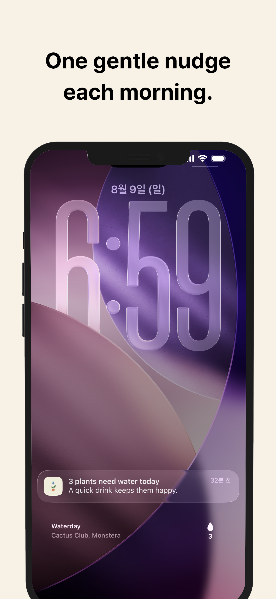

# Waterday

**Never forget to water again.**

Waterday is a plant watering reminder for iPhone. Tell it how often each plant needs water, and it tells you when — one morning summary, only on days something is actually thirsty.

> **No AI. No account. No subscription. Just water your plants.**
> Your plants, care history, and photos stay on your device. There is no sign-up and no server.

## Download

📲 **App Store — coming soon** (currently in review)

## Screenshots

| Today | Plants | Care Log | Lock Screen |
|:---:|:---:|:---:|:---:|
|  |  |  |  |

## Features

- 💧 **Today, at a glance** — every plant that needs water, one tap to mark it watered
- 🪴 **Every plant, its own rhythm** — per-plant watering intervals, unlimited and free
- 📒 **Care log** — watering, fertilizing, and repotting history for every pot
- ⏰ **Respectful reminders** — one morning summary, only when needed
- 🧩 **Widgets** — Home Screen and Lock Screen show what's thirsty
- 🎨 **Pot glaze themes** — greenhouse design in light & dark

## Legal

- [Privacy Policy](PRIVACY.md)
- [Terms of Service](TERMS.md)

## Tech

SwiftUI + SwiftData (App Group) · WidgetKit · Local notifications · Google Mobile Ads SDK v12 (SPM) · [XcodeGen](https://github.com/yonaskolb/XcodeGen) (`.xcodeproj` is generated, not committed)

## Building

```bash
brew install xcodegen
cp AdIDs.example.swift Sources/Ads/AdIDs.swift        # fill in your AdMob unit IDs
cp project-secrets.example.yml project-secrets.yml    # fill in your AdMob app ID
xcodegen generate
open Waterday.xcodeproj
```

Real AdMob identifiers and test-device IDs are intentionally excluded from this repository. DEBUG builds always use Google's sample ad units.

## Author

**MunKyeong Yang** — yang486741@gmail.com
